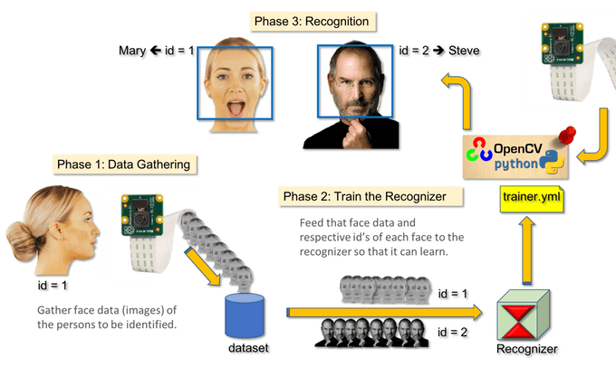
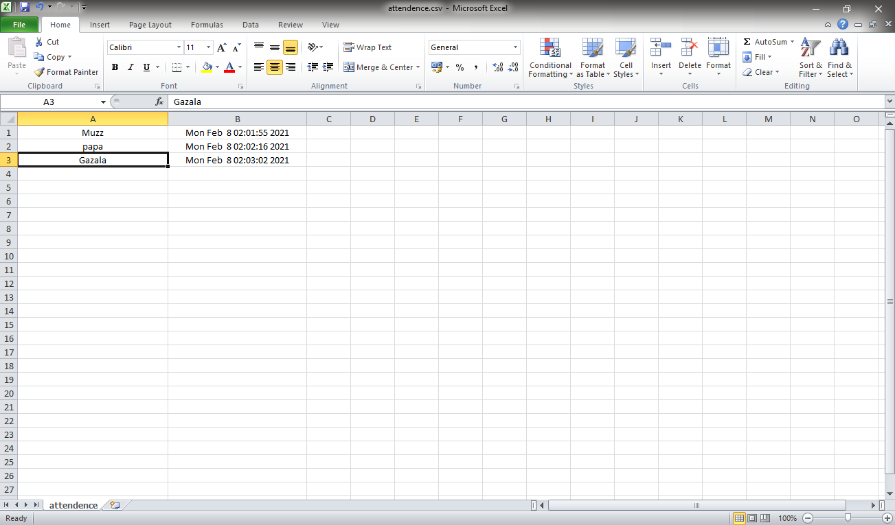

# Smart Attendence Management System

This project is capable of processing live video-stream of students entering the Online meeting or classroom and generate the list of attendees the class with exact time and date.

## Motivation
In the time of pandemic, Online Classes are the new common ways to tackle Odds. Inspiring from the need of Automation in Online Classes as much as possible to reduce the unnecessary work. This System will mark the attendance of students with the live camera video of the Online Lecture.

#Example

